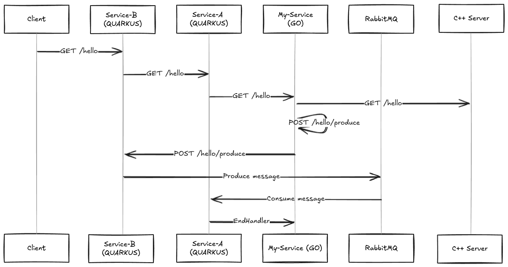
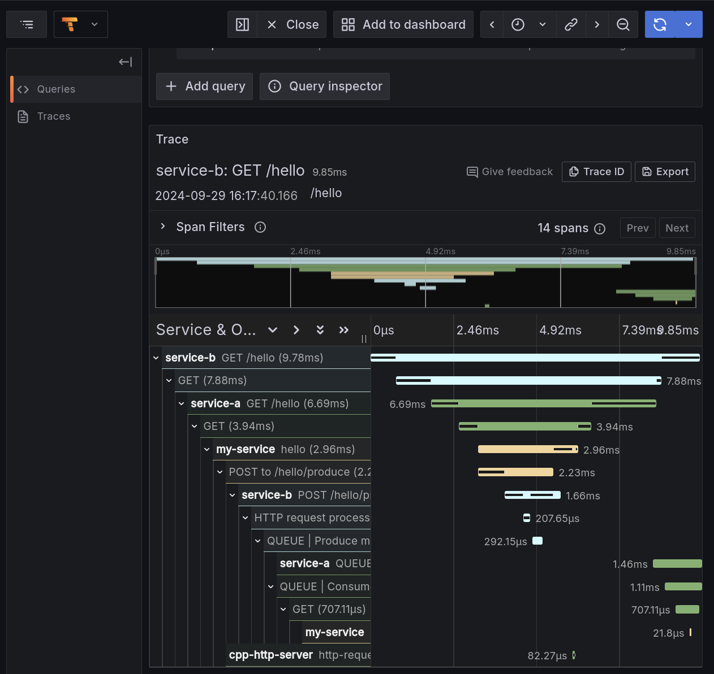

# Giro de Peppe
## Quarkus - Go - C++ - Tempo | Playground

This is a playground project to test the integration between Quarkus, Go, C++ and Tempo.

- Run the following command to start the project:

```bash
docker compose pull
```

```bash
docker compose up -d
```

```bash
curl http://localhost:1666/hello
```

- Go to Grafana ([http://localhost:3000](http://localhost:3000)), add Tempo datasource ([http://tempo:3200](http://tempo:3200)) and Enjoy the traces in the Explore view!


---



